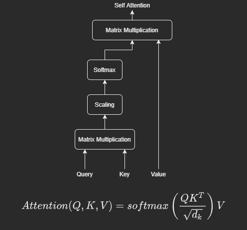

# Original Transformer for Bengali Translation [Work in Progress]

I come from a developing country named Bangladesh. Our mother tongue is Bengali. In this project, my plan is to translate different languages to Bengali. I am fascinated by transformer architecture. I have implemented the whole architecture from scratch using PyTorch. However, during machine translation, I am using PyTorch built-in transformer which is better optimized for use. I also have plans to deploy the model after the project. 

## Transformer

Transformer architecture was first introduced by Vaswani et. al. in [Attention Is All You Need](https://arxiv.org/abs/1706.03762) paper. If you're a beginner, you might be wondering why the transformer architecture brought down all the previous SotA Neural Machine Translation approaches and why is it so popular among AI practitioners and scientists. I will try to list down some of the reasons. 

- Better long-range dependency modeling.
- Gets rid of recurrent nets which make the model highly parallelizable and enables GPU computation.
- Multi-head Attention.

However, I would state here that even if the paper title says **attention** is all you need. They had to use positional encodings, feed-forwarding layers and label smoothing to make the whole thing work.

## Understanding Transformer from theoretical perspective

 I used the following resources to understand the ins and outs of transformer:  

- [Paper explanation by Yannic Kilcher](https://www.youtube.com/watch?v=iDulhoQ2pro)
- [Visually intuitive blog and video explanation by Jay Alammar](http://jalammar.github.io/illustrated-transformer/)
- [Illustrated step by step explanation by Micheal Phi](https://www.youtube.com/watch?v=4Bdc55j80l8) 
- [Blog post and lecture by Peter Bloem](http://peterbloem.nl/blog/transformers)

I broke down the blocks of the architecture into **6 distinguishing parts** to understand as a whole.

The transformer architecture looks like this

### 1. Input Embeddings

Machines do not understand the text but they can understand numbers. For this, we go through tokenization and numericalization processes. After these preprocessing steps, we get the representation of the text using Word Embedding techniques. If you're unfamiliar with word embedding. I am listing down some resources where you can know about them.  

- [Illustrated Word2Vec by Jay Alammar](https://jalammar.github.io/illustrated-word2vec/)
- [Detailed Word Embedding Blog by Manjeet Singh](https://medium.com/data-science-group-iitr/word-embedding-2d05d270b285)

### 2. Positional Encoding

Transformer architecture gets rid of recurrence. So, we need some way to understand order and position of words in a sentence. We need a new technique to do it so that we can satisfy some criteria as mentioned in Karimnejad's blog

- The technique should output a unique encoding for each word's position.
- Distance between any two word's position should be consistent across sentences with different lengths.
- Our model should generalize to longer sentences without any efforts.
- The technique must be deterministic.

The following encoding satisfies all the criterias. For every even position of words, we add the vector output from first equation. For every odd position of words, we add the vector output from second equation. After adding the positional encoding, we pass that to Encoder/Decoder Block. 

If you want to know more about why and how positional encoding works you can check the following blog:

- [Amirhossein Kazemnejad's Blog on Positional Encoding](https://kazemnejad.com/blog/transformer_architecture_positional_encoding/)

### 3. Encoder Blocks

#### 3.1. Multi-head Attention

We divide the input into many portions i.e. heads. All of them, pass through a Linear layer and Self Attention layer. We concat the output from all self attention heads and pass them to a Linear layer.

##### 3.1.1. Self-Attention

Q : queries => the target text to find attention  K : keys => the source text to find attention  V : values => actual values of the text  d_k : dimension of keys  

Steps:  

- Multiply Q with K and generate the score. The score determines how much focus to place on other parts of the input sentence as we encode a word at a certain position.
- Scaling the score. The softmax function can be sensitive to very large input values. These kill the gradient, and slow down learning, or cause it to stop altogether. Since the average value of the dot product grows with the embedding dimension k, it helps to scale the dot product back a little to stop the inputs to the softmax function from growing too large.
- Get the softmax value of the scaled product. Softmax maximizes the higher scores and depresses the lower scores and normalizes the scores so they’re all positive and add up to 1.
- Multiply the softmax output with V. The intuition here is to keep intact the values of the word(s) we want to focus on, and drown-out irrelevant words.

#### 3.2. Residual Connection

We can notice skip-connections in many places of the architecture. This is to retain some of the previous information as discussed in [Original ResNet Paper](https://openaccess.thecvf.com/content_cvpr_2016/papers/He_Deep_Residual_Learning_CVPR_2016_paper.pdf).

#### 3.3. Layer Normalization

Instead of batch normalization, we can see layer normalization. It directly estimates the normalization statistics from the summed inputs to the neurons within a hidden layer so the normalization does not introduce any new dependencies between training cases. For example, dependency on mini-batch size and so on. In short, it takes an average of every single example. You can know more about this in the following link. 

- [Layer Normalization Explanation by Papers with Code](https://paperswithcode.com/method/layer-normalization)

#### 3.4. Pointwise Feed Forward

We feed the output from Layer Normalization to a Linear Layer with ReLU activation function. Then again pass it to a Linear layer and a Dropout Layer. In between two Linear Layers. We expand the size once and the again move back to original embedding size. This returns us with encoder representation which can be used for many downstream task but that's not the domain of our project for now.

### 4. Output Embedding & Positional Encoding

Same as Input Embedding & Positional Encoding.

### 5. Decoder Blocks

#### 5.1 Masked Multi-head Attention

Same as the Encoder Block but here we need to do masking. While training the decoder, if it knows before training what comes next then the decoder cannot generalize well. So, here we need to mask those terms. How we do that is explained in Look-Ahead Mask Section

##### 5.1.1. Look-Ahead Mask

After the scaling process, we have an **sequence_length X sequence_length** size of matrix. There we add a Look-Ahead Mask like the picture so that the decoder don't have access to future tokens. 

NB: image taken from [Illustrated step by step explanation by Micheal Phi](https://www.youtube.com/watch?v=4Bdc55j80l8) 

#### 5.2 Cross-attention

This is exactly like Encoder Block Multi-head Attention. However, the query (Q) and key(K) come from encoder layer and value (v) come from Decoder Layer.

#### 5.3 Residual Connection, Layer Normalization & Pointwise Feed Forward

Same as Encoder Block.

### 6. Linear Classifier

There we have a Linear Layer and a Softmax Layer. The output size of equal to the vocab size where the softmax classifier maximizes the probability of the next work to come and depress others. After training, during inference time, we use different decoding techniques like greedy decoding or beam search.

## Implementing transformer from Scratch

I am implementing the original paper from scratch using PyTorch. I am using the following resources to understand the implementation:

- [The Annotated Transformer by Harvard NLP](http://nlp.seas.harvard.edu/2018/04/03/attention.html)
- [PyTorch official implementation](https://github.com/pytorch/pytorch/blob/187e23397c075ec2f6e89ea75d24371e3fbf9efa/torch/nn/modules/transformer.py) 
- [Implementation from Scratch by Gordic Aleksa](https://github.com/gordicaleksa/pytorch-original-transformer)
- [Implementation Walkthrough by Aladdin Persson](https://www.youtube.com/playlist?list=PLhhyoLH6Ijfyl_VMCsi54UqGQafGkNOQH) 

